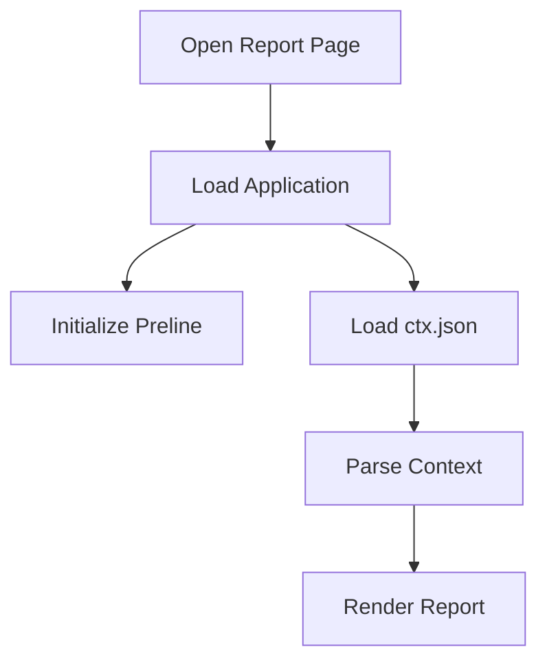
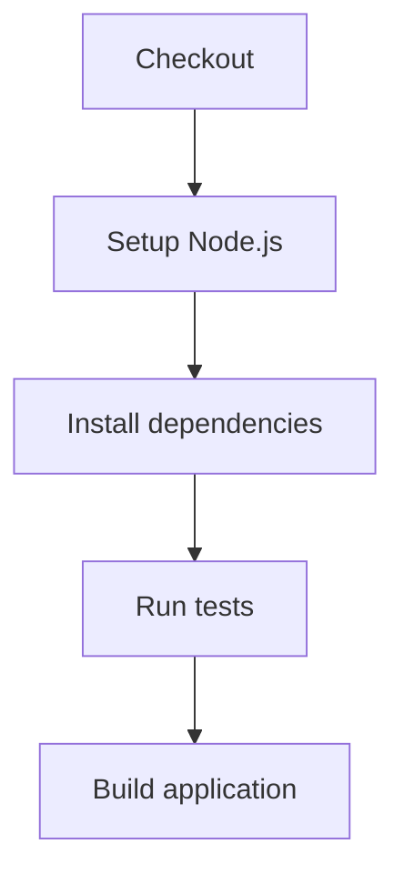
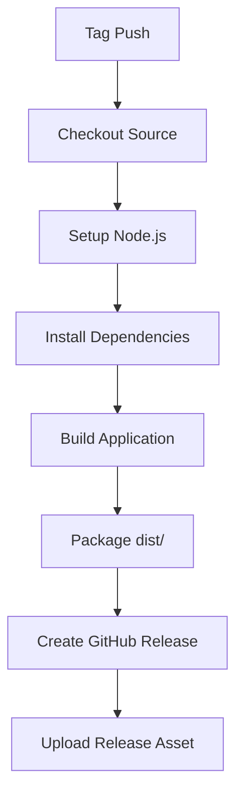
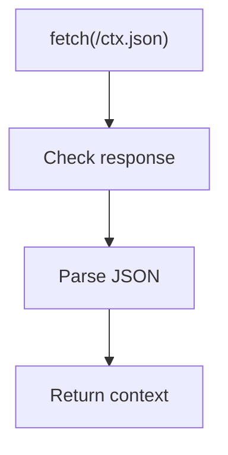

# CTX CLI Report

A static HTML report interface for viewing and presenting project execution context generated by [CTX CLI](https://github.com/abhisekmohantychinua/ctx-cli).

The report is a lightweight browser-based application built with Vite, TypeScript, Tailwind CSS, and Preline. It consumes exported CTX data and presents it through a collection of report pages.

## Purpose

`ctx-cli-report` is responsible for the presentation layer of CTX context.

CTX CLI stores project execution context such as:

- Sessions
- Tasks
- Logs
- Decisions

This project turns that context into a navigable HTML report that can be opened locally or hosted as a static site.

The report does not own or modify CTX project data. It reads the exported context and presents it.

## Technology Stack

The project currently uses:

- TypeScript
- Vite
- Tailwind CSS v4
- `@tailwindcss/vite`
- Preline
- Vitest
- npm

See [`package.json`](./package.json) for the current dependency and script definitions.

## Project Structure

```text
ctx-cli-report/
├── .github/
│   └── workflows/
│       ├── ci.yaml
│       └── release.yaml
│
├── src/
│   ├── data/
│   │   └── loader.ts
│   │
│   ├── pages/
│   │   ├── index.html
│   │   ├── sessions.html
│   │   ├── tasks.html
│   │   ├── logs.html
│   │   └── decisions.html
│   │
│   ├── main.ts
│   └── style.css
│
├── test/
│   └── main.spec.ts
│
├── package.json
├── package-lock.json
├── tsconfig.json
├── vite.config.ts
└── vitest.config.ts
```

### Source directories

`src/pages/`

Contains the HTML entry points for the report.

The application currently has separate pages for:

```text
index.html
sessions.html
tasks.html
logs.html
decisions.html
```

`src/data/`

Contains data-loading functionality.

The current loader retrieves `/ctx.json` and parses it as JSON.

`src/main.ts`

Application entry point. It loads the CTX context, imports the application stylesheet, and initializes Preline components after the DOM has loaded.

`test/`

Contains automated tests executed by Vitest.

The current Vitest configuration discovers test files under `test/**/*.spec.ts`.

## Requirements

Install the following before working on the project:

- Node.js 24
- npm

Check the installed versions:

```bash
node --version
npm --version
```

## Getting Started

Clone the repository:

```bash
git clone https://github.com/abhisekmohantychinua/ctx-cli-report.git
cd ctx-cli-report
```

Install dependencies:

```bash
npm ci
```

`npm ci` is preferred for repository setup because it installs exactly the versions recorded in `package-lock.json`.

## Development

Start the Vite development server:

```bash
npm run dev
```

The development configuration intentionally uses the repository root as the Vite root. The individual report pages are located under `src/pages/`, so the development server exposes those source pages directly.

The primary pages are:

```text
/src/pages/index.html
/src/pages/sessions.html
/src/pages/tasks.html
/src/pages/logs.html
/src/pages/decisions.html
```

Open the page you are currently developing in the browser and use the Vite development server for automatic updates.

## Context Data

The report reads CTX context from:

```text
/ctx.json
```

The current data loader performs a browser `fetch()` against that path and parses the response as JSON.

A development data file can therefore be placed at the web root:

```text
ctx-cli-report/
└── ctx.json
```

When running the Vite development server, the file becomes available at:

```text
http://localhost:5173/ctx.json
```

The report should be treated as a read-only consumer of this data.

## Build

Create a production build:

```bash
npm run build
```

The build script executes: `tsc && vite build`

The Vite configuration produces a multi-page static build containing the report pages and compiled assets.  

A successful build produces:

```text
dist/
├── index.html
├── sessions.html
├── tasks.html
├── logs.html
├── decisions.html
└── assets/
    ├── *.css
    └── *.js
```

The production build uses relative asset paths so the generated report can be served from a static location without requiring the application to be mounted at the domain root.

## Previewing the Production Build

After building:

```bash
npm run preview
```

Vite will serve the generated `dist/` directory through its preview server.

Use preview when verifying the production build rather than relying only on the development server.

## Testing

The project uses [Vitest](https://vitest.dev/) for automated testing.

The current test environment is Node.js, and test files are discovered from:

```text
test/**/*.spec.ts
```

This keeps browser-facing source code separate from the project's automated test suite.

### Run the test suite

```bash
npm test
```

### Watch mode

Run Vitest interactively while developing:

```bash
npm run test:watch
```

### Coverage

Generate test coverage:

```bash
npm run test:coverage
```

### Test files

Tests should follow the existing convention:

```text
test/
└── <name>.spec.ts
```

For example:

```text
test/
├── main.spec.ts
├── loader.spec.ts
└── formatter.spec.ts
```

## Testing Guidelines

Tests should verify observable behavior rather than implementation details.

A good test should make three things clear: `Input / State`, `Behavior` and `Expected Result`.

Prefer focused tests covering one meaningful behavior.

For example:

```ts
describe("context loader", () => {
  it("loads context successfully when the request succeeds", async () => {
    // Arrange
    // Act
    // Assert
  });
});
```

Keep test data deterministic and avoid depending on a developer's filesystem, browser state, or external services.

### Browser behavior

The current Vitest configuration uses the Node environment. This is suitable for pure TypeScript logic and other non-DOM behavior.

Browser-specific tests should only be introduced when the report contains behavior that genuinely requires a DOM environment.

When browser behavior becomes part of the test suite, the test environment and supporting dependencies should be updated deliberately rather than adding browser emulation to every test by default.

## Application Workflow

The report application follows a simple runtime flow:



The application entry point loads the context asynchronously and initializes Preline after the DOM is ready.

## Development Workflow

The project follows a simple development workflow aligned with the main CTX CLI repository.

```text
flowchart TD
    A["feature/*"] --> B["Pull Request"]
    B --> C["CI"]
    C --> D["Review"]
    D --> E["Merge to main"]
    E --> F["Release Tag"]
    F --> G["GitHub Release"]
```

### Create a feature branch

```bash
git checkout -b feature/report-navigation
```

### Work on the feature

Run the development server:

```bash
npm run dev
```

Run tests while developing:

```bash
npm run test:watch
```

Run a production build before submitting the change:

```bash
npm run build
```

### Commit changes

```bash
git add .
git commit -m "Add report navigation"
```

### Push the branch

```bash
git push origin feature/report-navigation
```

### Open a Pull Request

Create a Pull Request from:

```text
feature/report-navigation → main
```

CI should pass before the Pull Request is merged.

## Continuous Integration

GitHub Actions is used for continuous integration.

The CI workflow runs on:

```text
Push to main
Pull Requests targeting main
```

The pipeline validates the project by:



The repository should remain buildable and testable on every change merged into `main`.

## Release Workflow

Releases are created from version tags.

CTX uses Semantic Versioning:

```text
MAJOR.MINOR.PATCH
```

Examples:

```text
v0.1.0
v0.2.0
v1.0.0
```

Create a release tag from an up-to-date `main` branch:

```bash
git checkout main
git pull origin main

git tag v0.1.0
git push origin v0.1.0
```

The release workflow is triggered by tags matching:

```text
v*.*.*
```

## Release Build

The release workflow:



The production output is packaged as a ZIP archive.

The contents of `dist/` are placed directly in the archive. The `dist` directory itself is not included.

For example:

```text
ctx-cli-report-v0-1-0.zip
├── index.html
├── sessions.html
├── tasks.html
├── logs.html
├── decisions.html
└── assets/
    ├── main-....css
    └── main-....js
```

The release archive name is derived from the Git tag:

```text
v0.1.0 → ctx-cli-report-v0-1-0.zip
v1.2.3 → ctx-cli-report-v1-2-3.zip
```

## Static Hosting

The generated report is a static web application.

After building, the contents of `dist/` can be deployed to a static hosting platform such as:

- GitHub Pages
- Cloudflare Pages
- Netlify
- Vercel
- Any static web server

The deployment must preserve the generated directory structure and the `assets/` directory.

## Working on a Page

Each page is an independent HTML entry point.

For example:

```text
src/pages/tasks.html
```

The page can use shared application code through:

```html
<script type="module" src="../main.ts"></script>
```

Shared styling belongs in the project stylesheet rather than duplicating CSS across individual pages.

When adding a page:

1. Add the HTML entry point under `src/pages/`.
2. Add the page to the Vite multi-page input configuration.
3. Add navigation from the appropriate report pages.
4. Verify the page through the development server.
5. Verify the production build.
6. Add tests for non-trivial application behavior.

The Vite configuration explicitly declares every production page entry point, so a newly added report page must also be registered there.

## Working on Data Loading

Data loading currently lives under:

```text
src/data/
```

The loader is responsible only for obtaining and parsing the context source.

Current behavior:



A failed HTTP response results in an error containing the HTTP status.

Presentation code should not duplicate this loading logic.

As the application grows, data transformation and presentation-specific formatting should remain separate from the transport layer.

## Working on Styling

Tailwind CSS is integrated through the Vite plugin.

The project also uses Preline for interactive UI components.

When adding UI:

- Prefer existing Tailwind utilities.
- Reuse existing Preline components where appropriate.
- Keep shared styles in `src/style.css`.
- Avoid introducing another UI framework without a clear architectural reason.
- Keep report pages visually consistent.

Preline is initialized from the application entry point through `HSStaticMethods.autoInit()`.

## Working on Tests

When adding production behavior, add the corresponding test in:

```text
test/
```

A typical workflow is:

```bash
npm run test:watch
```

Make the change, verify the focused tests, then run:

```bash
npm test
npm run build
```

Before pushing a Pull Request, both the complete test suite and production build should pass locally.

## Quality Checks

Before opening a Pull Request, run:

```bash
npm ci
npm test
npm run build
```

For an additional local production check:

```bash
npm run preview
```

Verify that:

- All report pages build successfully.
- Static assets load correctly.
- `ctx.json` is available where expected.
- Navigation between report pages works.
- Tests pass.
- No development-only assumptions are required by the production build.

## Versioning Strategy

The repository follows Semantic Versioning:

```text
MAJOR.MINOR.PATCH
```

Examples:

```text
0.1.0
0.2.0
1.0.0
```

Git tags are the source of truth for releases:

```text
v0.1.0
v0.2.0
v1.0.0
```

The GitHub Release workflow creates the distributable report archive from the tagged commit.

## Repository

Source repository:

```text
https://github.com/abhisekmohantychinua/ctx-cli-report
```

Related project:

```text
https://github.com/abhisekmohantychinua/ctx-cli
```

## Development Principles

The report project should remain:

- Static.
- Lightweight.
- Easy to build.
- Easy to test.
- Independent of a backend service.
- Focused on presenting CTX execution context.
- Suitable for local use and static hosting.

The report should avoid unnecessary runtime infrastructure when the same behavior can be implemented with static assets and client-side code.

## Current Status

The project is under active development.

The repository currently contains the initial report pages, application bootstrap, CTX data loading, Tailwind/Preline integration, and the initial Vitest setup.

New report functionality should be added incrementally while keeping the build, test, and static-release workflows working.
